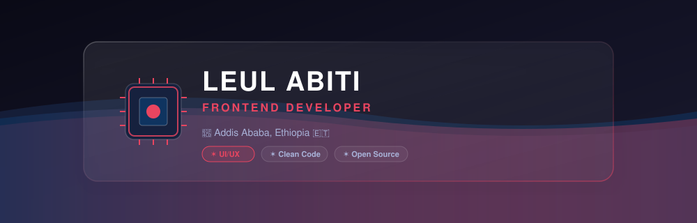
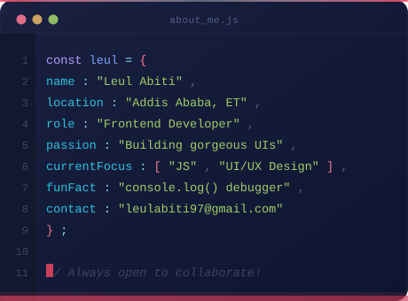
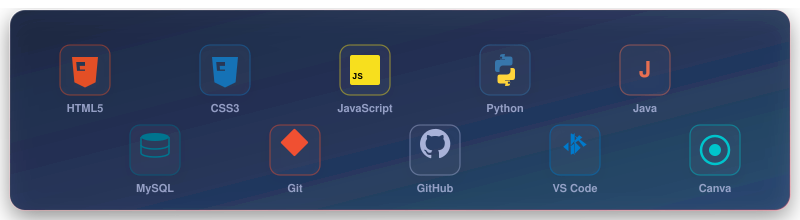

<!-- Layered Header Banner -->

 

<!-- Typing Intro Mission Statement -->

---

<!-- Two-Column Widget Layout -->
<table width="100%" border="0" cellspacing="10" cellpadding="0">
<tr>
<!-- Left Column: Profile Data -->
<td width="49%" valign="top">

<!-- Widget 1: About Me (IDE Code Terminal) -->

  

<!-- Widget 2: Connect With Me -->
<table width="100%" border="0" cellspacing="0" cellpadding="8">
<tr>
<td bgcolor="#16213e" align="center">
<b>🌐 CONNECT WITH ME</b>
</td>
</tr>
<tr>
<td bgcolor="#16213e" align="center">
 

  

  
</td>
</tr>
</table>

</td>

<!-- Right Column: Live Analytics -->
<td width="49%" valign="top">

<!-- Widget 3: Live System Analytics -->
<table width="100%" border="0" cellspacing="0" cellpadding="8">
<tr>
<td bgcolor="#16213e" align="center">
<b>📊 SYSTEM ANALYTICS</b>
</td>
</tr>
<tr>
<td bgcolor="#16213e" align="center">
 
<!-- GitHub Stats Card -->

  
<!-- Top Languages Card -->

  
<!-- Streak Stats Card -->

  
</td>
</tr>
</table>

</td>
</tr>
</table>

 

<!-- Floating Tech Cloud Widget -->
<table width="100%" border="0" cellspacing="0" cellpadding="8">
<tr>
<td bgcolor="#16213e" align="center">
<b>🛠️ INTEGRATED TECH STACK</b>
</td>
</tr>
<tr>
<td bgcolor="#16213e" align="center">

</td>
</tr>
</table>

 

<!-- Project Spotlight (Mission Log Table) -->
<table width="100%" border="0" cellspacing="0" cellpadding="8">
<tr>
<td bgcolor="#16213e" align="center">
<b>🚀 FEATURED MISSION LOGS (PROJECTS)</b>
</td>
</tr>
<tr>
<td bgcolor="#16213e">

<table width="100%" border="0" cellspacing="1" cellpadding="10">
<thead>
<tr bgcolor="#1a1a2e">
<th align="center" width="10%">ID</th>
<th align="left" width="25%">PROJECT</th>
<th align="left" width="40%">MISSION OBJECTIVE</th>
<th align="center" width="15%">TECH STACK</th>
<th align="center" width="10%">STATUS</th>
</tr>
</thead>
<tbody>
<tr bgcolor="#0f3460">
<td align="center"><b>ML-01</b></td>
<td><a href="https://github.com/leul-cpu/leulfit" style="color: #ffffff; text-decoration: none;"><b>💪 LeulFit</b></a></td>
<td>Fitness-focused web application for tracking workouts and health statistics.</td>
<td align="center">HTML / CSS</td>
<td align="center">● Stable</td>
</tr>
<tr bgcolor="#121224">
<td align="center"><b>ML-02</b></td>
<td><a href="https://github.com/leul-cpu/MED-CHAIN" style="color: #ffffff; text-decoration: none;"><b>🏥 MED-CHAIN</b></a></td>
<td>Secure medical chain flow simulator for managing health logs.</td>
<td align="center">JavaScript</td>
<td align="center">● Active</td>
</tr>
<tr bgcolor="#0f3460">
<td align="center"><b>ML-03</b></td>
<td><a href="https://github.com/leul-cpu/My-Portifolio" style="color: #ffffff; text-decoration: none;"><b>🌐 My Portfolio</b></a></td>
<td>All interactive components and professional client records in one portal.</td>
<td align="center">HTML / CSS</td>
<td align="center">● Live</td>
</tr>
<tr bgcolor="#121224">
<td align="center"><b>ML-04</b></td>
<td><a href="https://github.com/leul-cpu/Bellanawit" style="color: #ffffff; text-decoration: none;"><b>💼 Client Sites</b></a></td>
<td>Client portfolio websites for Bellanawit and Moh with modern animations.</td>
<td align="center">HTML / CSS</td>
<td align="center">● Deployed</td>
</tr>
<tr bgcolor="#0f3460">
<td align="center"><b>ML-05</b></td>
<td><a href="https://github.com/leul-cpu/Simple-Task-Manager" style="color: #ffffff; text-decoration: none;"><b>📝 Task Manager</b></a></td>
<td>A clean and lightweight web-based interface for managing task streams.</td>
<td align="center">JS / HTML</td>
<td align="center">● Complete</td>
</tr>
</tbody>
</table>

</td>
</tr>
</table>

 

<!-- Contribution Snake (Framed as Live System Monitor) -->
<table width="100%" border="0" cellspacing="0" cellpadding="8">
<tr>
<td bgcolor="#16213e" align="center">
<b>👾 LIVE SYSTEM MONITOR (ACTIVITY GRID)</b>
</td>
</tr>
<tr>
<td bgcolor="#16213e" align="center">
 

  
</td>
</tr>
</table>

 

<i>⭐ If you like what you see, drop a star — it means the world! 🙏</i>

